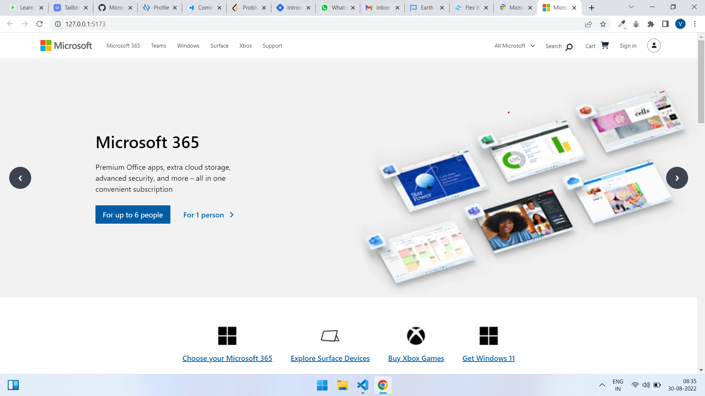
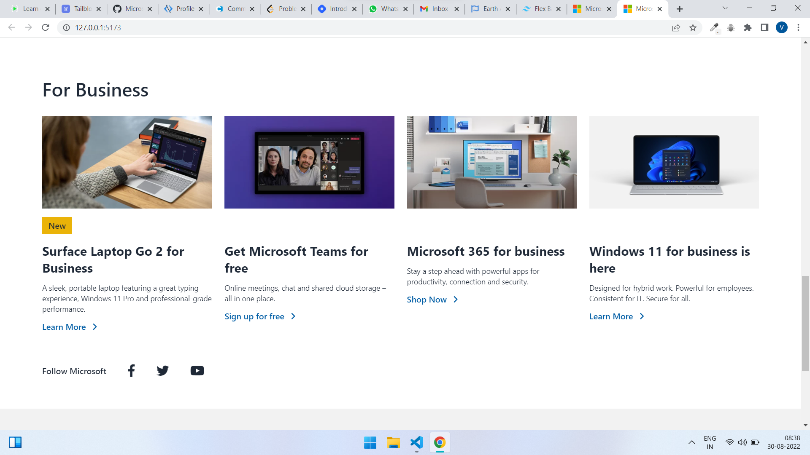
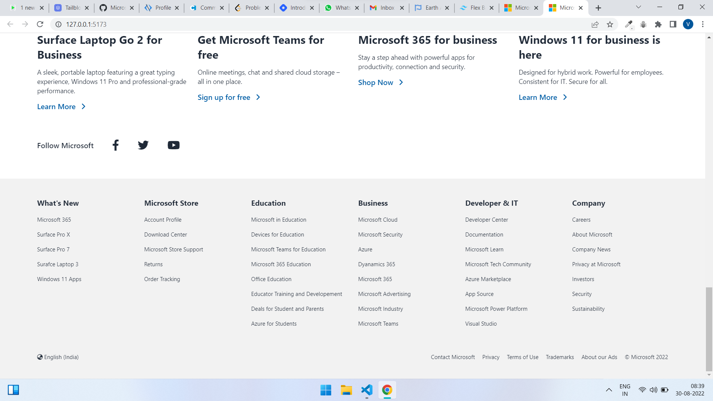

# **Microsoft UI Clone by Vinay Pratap Singh** 
## **Overview**
This is a complete user interface clone of the popular website Microsoft. This webpage contains all the elements which were available on the original website from top to bottom. 

The intension behind this project was to improve and brush up my HTML and Tailwind CSS knowledge, so that next time I can hunt down more websites and design in a very efficient way in a very less amount of time.

This project is completely **responsive** for both the **PC** and **Mobile phone** device.

## **Technology Used**
1. Pure HTML
2. Tailwind CSS
3. Daisy UI ( For Carousel )

## **Live Link**
This website is live for you to check and recommend some updates or issues to improve it.

## **Output Samples** 
    
    
    